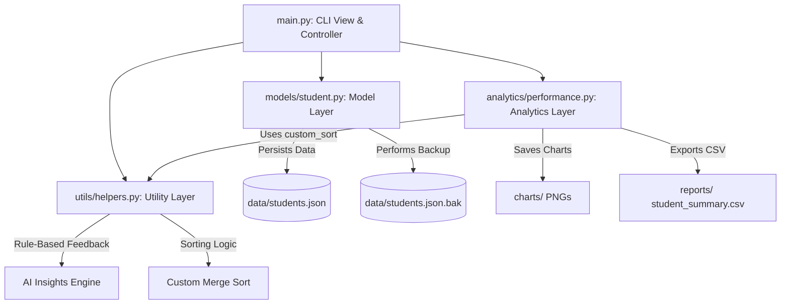

# Student Performance Analytics System

A complete, professional, modular Python terminal application that implements student academic record management, calculates performance statistics, ranks students, generates rule-based AI performance insights, and outputs high-quality data visualizations using Matplotlib.

## 🌟 Key Features

1. **Modular Architecture:** Fully separated layers representing Utilities, Models, Analytics, and a CLI Entrypoint.
2. **Stable Custom Merge Sort:** Custom implementation of a stable Merge Sort algorithm that supports custom key extraction and reverse sorting. It powers all list rankings and leaderboards.
3. **Resilient JSON Database Layer:** Complete CRUD operations with a persistent JSON store featuring automatic backup creation and error-resilient recovery from corrupt database states.
4. **Validation Layer:** Robust validation of Student IDs, names, class sections, subjects, and marks using optimized regex and range patterns.
5. **AI Performance Insights Engine:** Contextual feedback generator identifying academic strengths, improvement areas, performance consistency (using standard deviation), and student academic risk warnings.
6. **Data Visualization:** High-quality PNG charts including Subject Average comparisons, Grade distributions (pie chart), and Top Performers (horizontal bar chart).
7. **Report Exports:** CLI visuals with Unicode frames, plain text report cards, and all-student database exports in clean CSV formats.

---

## 🏗️ System Architecture



---

## 📁 Directory Structure

```text
student_performance_analytics/
│
├── data/
│   ├── students.json      # Database file
│   └── students.json.bak  # Automated backup database file
│
├── reports/
│   ├── student_summary.csv
│   └── report_card_STD-XXXX.txt
│
├── charts/
│   ├── subject_averages.png
│   ├── grade_distribution.png
│   └── top_performers.png
│
├── logs/
│   └── app.log            # System event and audit logger
│
├── models/
│   ├── __init__.py
│   └── student.py         # Student & DatabaseManager classes
│
├── analytics/
│   ├── __init__.py
│   └── performance.py     # Analytics & ReportGenerator classes
│
├── utils/
│   ├── __init__.py
│   └── helpers.py         # Custom sort, validation, & AI Insights
│
├── main.py                # Menu-driven CLI entrypoint
├── requirements.txt       # Matplotlib dependency
└── README.md              # Project documentation (this file)
```

---

## 🚀 Setup & Execution Guide

Follow these steps to run the application in a virtual environment:

### 1. Set Up Virtual Environment

Open your terminal, navigate to the project directory, and create a virtual environment:

**On Windows:**
```bash
python -m venv venv
venv\Scripts\activate
```

**On macOS/Linux:**
```bash
python3 -m venv venv
source venv/bin/activate
```

### 2. Install Dependencies

Install the required library (`matplotlib`) using `requirements.txt`:
```bash
pip install -r requirements.txt
```

### 3. Run the Application

Execute the main CLI terminal runner:
```bash
python main.py
```

---

## 📊 Analytics and Visuals

When navigating the CLI, choosing option `7` (Class Analytics Dashboard & Save Charts) will output:
1. **Class Pass Rate & Class Average**
2. **Class Topper** (Highest Scorer) & **Needs Support** (Lowest Scorer)
3. **Subject-Wise Performance Metrics Table** (Averages, Highs, Lows, and Enrollment Counts)
4. **Class Leaderboard (Top 5)** ranked via stable Merge Sort.
5. **Matplotlib Visual Charts** saved directly to the `charts/` folder:
   - `charts/subject_averages.png`: Subject Average comparisons.
   - `charts/grade_distribution.png`: Sector pie chart of academic grades.
   - `charts/top_performers.png`: Horizontal bar chart showcasing top students.

---

## 🛡️ Robust Logging & Diagnostics

Any execution warnings, database transactions, CSV export statements, or visual plot generations are logged in `logs/app.log`. In the event of system errors or bad files, consult this file to diagnose the trace.
